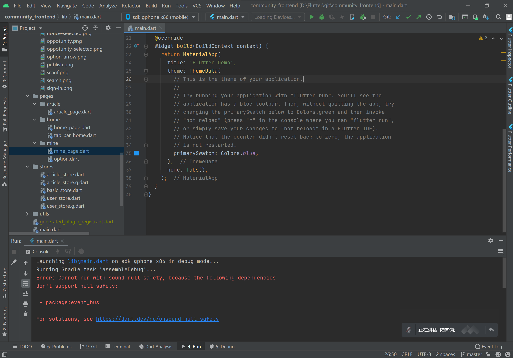

flutter sdk 版本升级到2.0或者更高的版本后就发现运行时会报错：

```dart
enter code hereError: Cannot run with sound null safety, because the following dependencies
don't support null safety:

 - package:loading_indicator_view
 - package:flutter_swiper
 - package:flutter_page_indicator
 - package:transformer_page_view
 
For solutions, see https://dart.dev/go/unsound-null-safety

FAILURE: Build failed with an exception.
```


也就是说以上有些包不支持 safety模式。

### 解决方案：

--no-sound-null-safety

- run

flutter run --no-sound-null-safety

- build
 
flutter build apk --no-sound-null-safety



