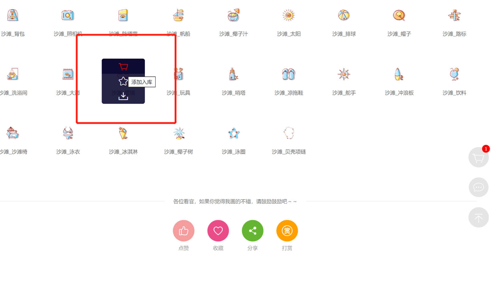
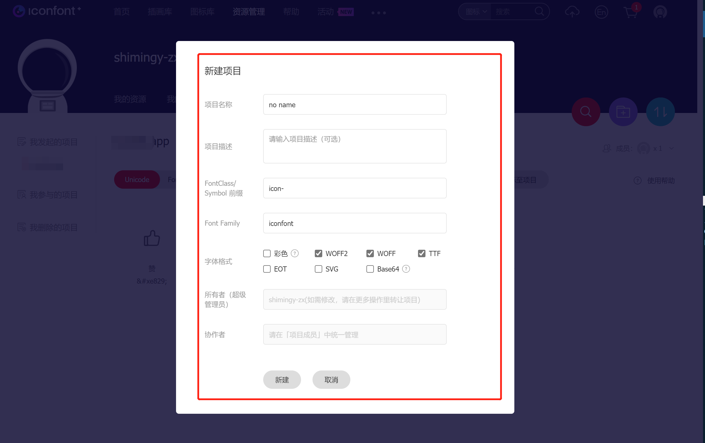
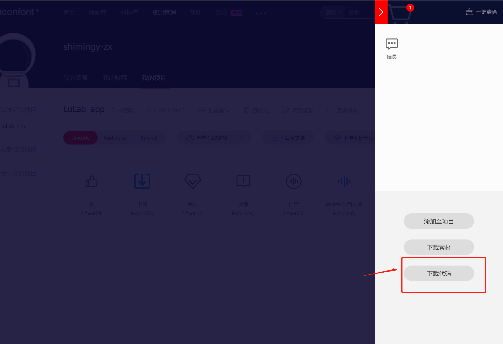
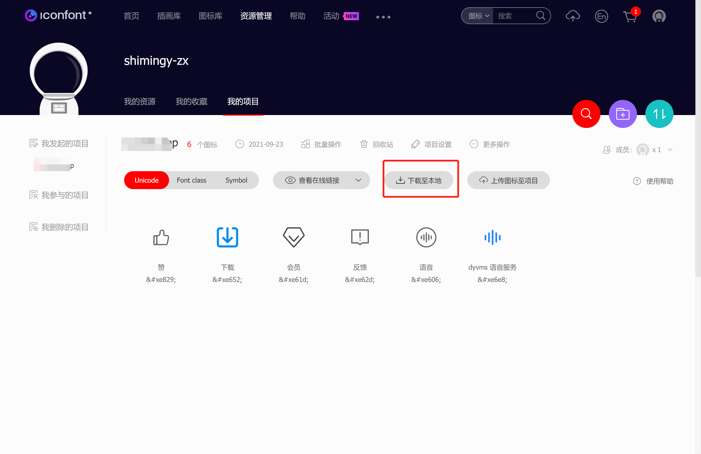
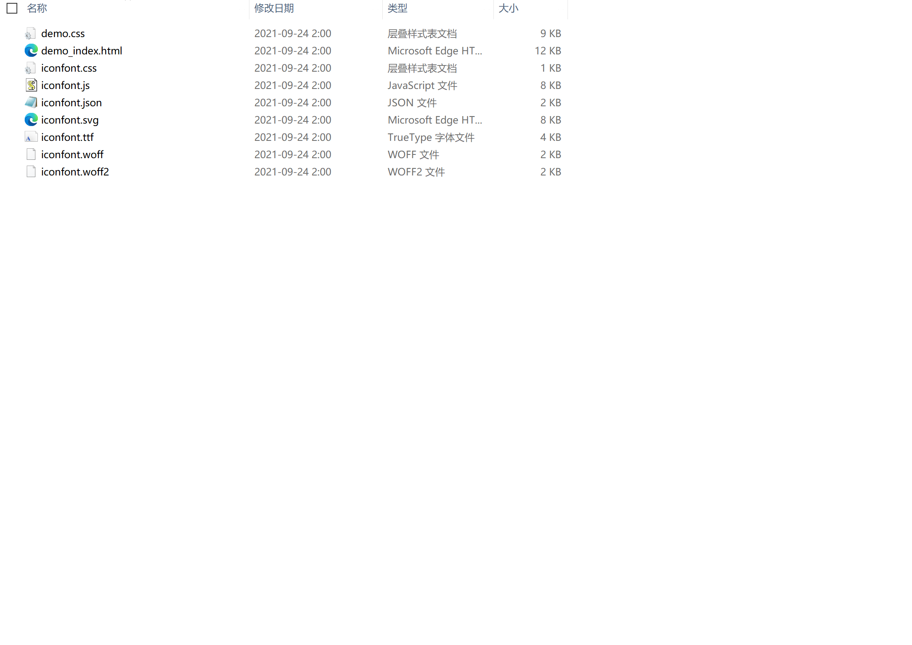
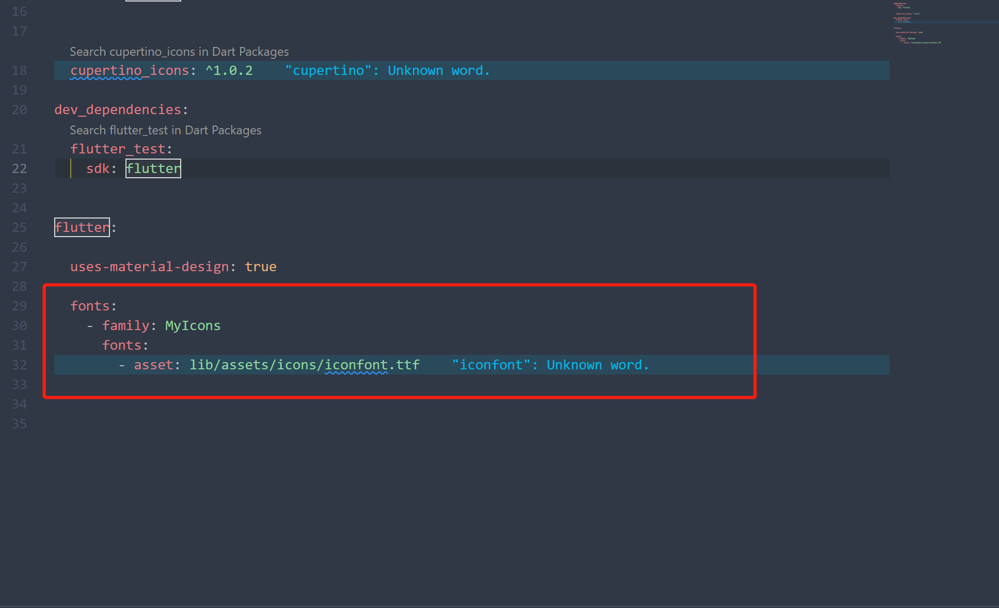
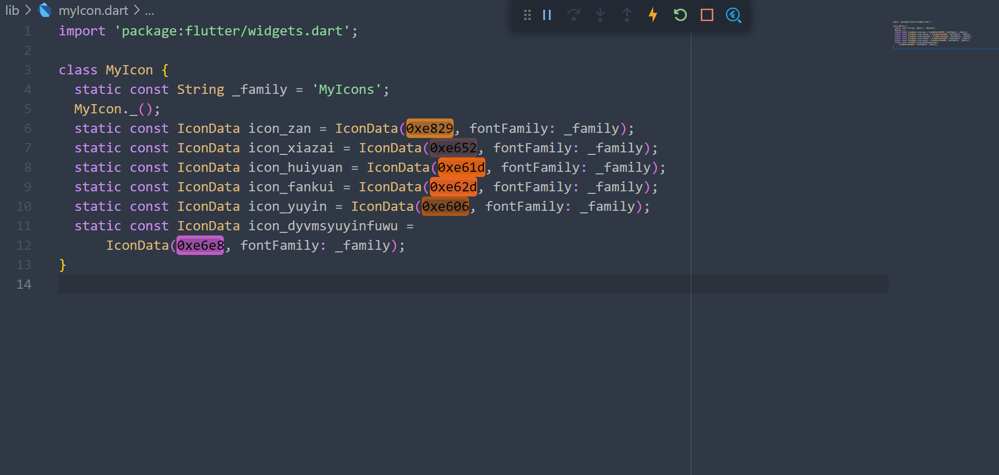
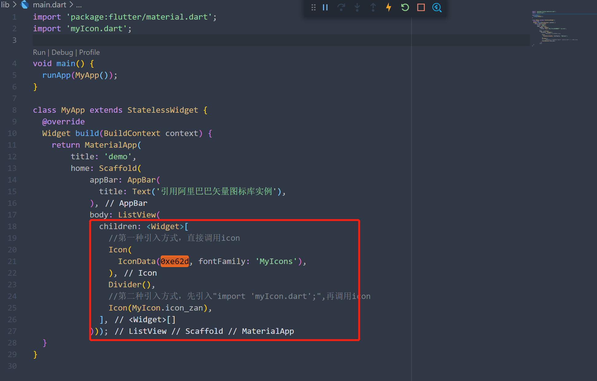
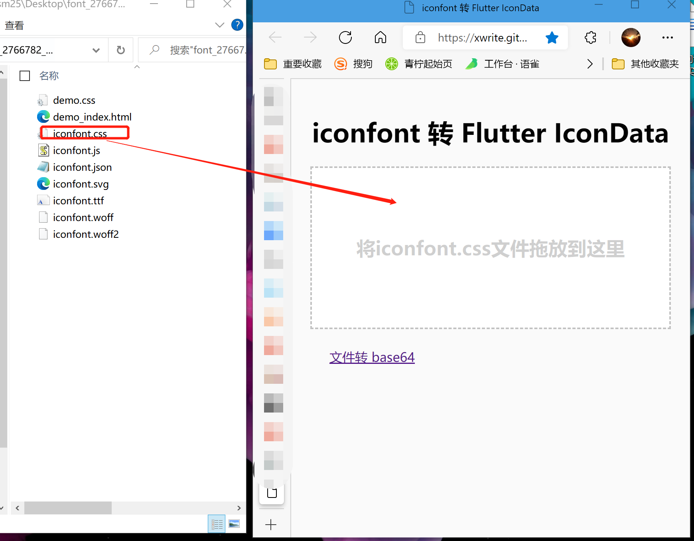
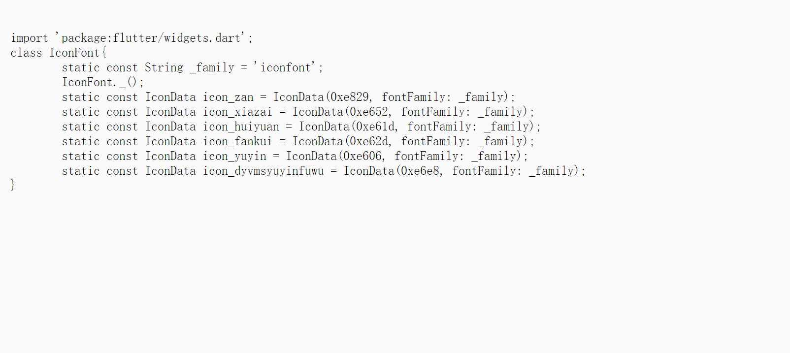

项目制作中，flutter自带的图标无法满足业务需求，需要引入第三方图标，如引入阿里图标

[阿里巴巴矢量图标库](https://www.iconfont.cn/)

- 登录阿里图标网站，选择合适图标，点添加入库（如下图）




- 也可把相应的icon添加至项目后再统一下载




- 选择自己所需要的icon图标加入购物车，点击购物车，点击下载代码。




项目icon下载




解压下载的压缩包,会得到如下文件，找到.ttf结尾的文件





配置 pubspec.yaml 文件，将字体文件引入，MyIcons为自定义名称

```
  fonts:
    - family: MyIcons
      fonts:
        - asset: lib/assets/icons/iconfont.ttf

```

添加后如下图：



复制iconfont.ttf文件到项目中
我的存放路径是：

```
lib/assets/icons/iconfont.ttf
```


下面有两种方法可以引用自定义的icon，第一种为直接调用，


第二种则可以先建立一个Dart文件进行封装后调用。编写.dart文件，创建一个.dart文件（存放位置可根据个人喜好，我放在了lib目录下，我创建的名字为： myIcon.dart）。

在该文件编写如下：



代码如下：

```
import 'package:flutter/widgets.dart';

class MyIcon {
  static const String _family = 'MyIcons';
  MyIcon._();
  static const IconData icon_zan = IconData(0xe829, fontFamily: _family);
  static const IconData icon_xiazai = IconData(0xe652, fontFamily: _family);
  static const IconData icon_huiyuan = IconData(0xe61d, fontFamily: _family);
  static const IconData icon_fankui = IconData(0xe62d, fontFamily: _family);
  static const IconData icon_yuyin = IconData(0xe606, fontFamily: _family);
  static const IconData icon_dyvmsyuyinfuwu =
      IconData(0xe6e8, fontFamily: _family);
}

```


第一种引入方式，直接调用icon

`Icon( IconData(0xe62d, fontFamily: 'MyIcons'), ),`

第二种引入方式，先引入"import 'myIcon.dart';"，再调用icon

实例代码如下：

```
import 'package:flutter/material.dart';
import 'myIcon.dart';

void main() {
  runApp(MyApp());
}

class MyApp extends StatelessWidget {
  @override
  Widget build(BuildContext context) {
    return MaterialApp(
        title: 'demo',
        home: Scaffold(
            appBar: AppBar(
              title: Text('引用阿里巴巴矢量图标库实例'),
            ),
            body: ListView(
              children: <Widget>[
                //第一种引入方式，直接调用icon
                Icon(
                  IconData(0xe62d, fontFamily: 'MyIcons'),
                ),
                Divider(),
                //第二种引入方式，先引入"import 'myIcon.dart';",再调用icon
                Icon(MyIcon.icon_zan),
              ],
            )));
  }
}

```


效果如图


iconfont.css 快速生成 myIcon.dart 在线小工具[https://xwrite.gitee.io/blog/](https://xwrite.gitee.io/blog/)

方法：
找到从阿里图标库下载的压缩包，打开压缩包后找到iconfont.css文件，在浏览器中打开https://xwrite.gitee.io/blog/，将iconfont.css文件拖入至改网页中。复制生成的代码到自己创建的字体图标文件中，更改该文件中的_family的值为自己在pubspec.yaml文件中的family值。






实例项目地址
