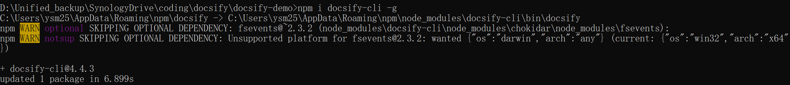

报错信息



npm WARN optional SKIPPING OPTIONAL DEPENDENCY: fsevents@~2.3.2 (node_modules\docsify-cli\node_modules\chokidar\node_modules\fsevents):
npm WARN notsup SKIPPING OPTIONAL DEPENDENCY: Unsupported platform for fsevents@2.3.2: wanted {"os":"darwin","arch":"any"} (current: {"os":"win32","arch":"x64"})

解决办法

解决办法1：

这是warning错误，是因为mac下需要 fsevents，在windows或linux环境下，请忽略这个错误。


解决办法2

```
npm install --no-optional --verbose
```
