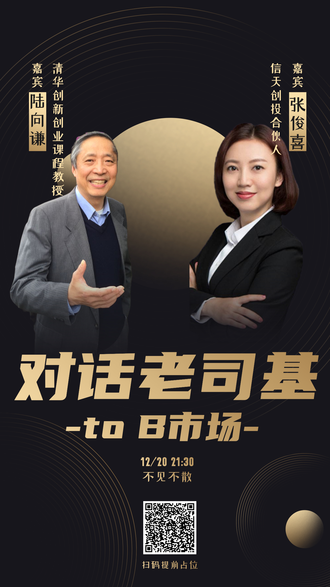

### 嘉宾：张俊熹-Jennifer

### 介绍：信天创投合伙人

恒生电子>金融行业

广联达>800亿（100多亿美金）
要创造100亿美金的价值才行！

中国toB市场没有起来是因为中国国情的原因还是晚10年！

明源云，可以看一下相应的案例

创业者加入B端行业的门槛是非常高的！
要对本行业有极高的认知
也要对互联网行业有足够的认知（需要技术人才）

懂产业+懂技术

陆老师：
张俊熹：回扣是有，大不了中国比较严重，这个不是主要的原因！

陆老师：在加入toC之前最好要在C端做过一定的时间！

CTO CRO（首席信息官）

陆老师：国内制造业为什么不用数字化工具
张俊熹：国内传媒，金融行业是最先使用数字化工具的！生意本身就是数字化的生意，具备良好的数字化基础。（金融行业高度牌照化）

陆向谦：第二个假设，腾讯阿里（钉钉，企业微信）会造成垄断吗？（）
张俊熹：阿里形成了数据和业务闭环

sap软件

华为在全国建立了150多个基地，云和软件一起卖

法大大

阴阳合同

微服务架构

两个维度（中国未来方向）
收并购（横向）

在线挂号

酷家乐

用友，企业

蓝湖设计

优秀的公司（）

爱设计

光云科技（成立创投基金）

亚马逊（第三方：中国占2/3）

资金使用效率

用钱去快速换市场

为什么只投toB

####

企企科技》用友

华为云绑定云产品免费使用两年

电话营销》无效

利用当地的市场资源拜访

要依附于当地的营销力量

》会计人员本身不愿意推广

在创投的角度来讲，市场教育还需要多长时间

docker sell